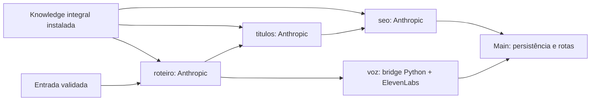

# Provedores independentes — contrato para integração pelo main

CommonJS, Node >=22. `require('./workflow/providers').createProviders({env, fetchImpl})`
retorna `roteiro`, `titulos`, `seo`, `voz`. Defaults: `process.env` e `fetch` nativo.
`createProviders()` sem argumentos funciona e não valida chaves nem inicia chamadas
durante a construção; configuração é validada na execução de cada provedor.
Cada função recebe `{input, outputs, signal, markExternalStarted}` e retorna
`{data}` ou `{data, files:[{name, mime, bytes:Buffer}]}`. Não faz persistência de
jobs, rotas, ZIP, publicação ou atualização do relatório. O temporário de voz é
exclusivo de cada chamada e removido após o processo encerrar.

## Entradas e saídas

`input` aceita somente transcript, script, title, channel, operation e settings.
Settings aceita somente `language`/`targetLanguage` (identificador de idioma,
por exemplo `pt-BR` ou `en`), `durationSeconds` (inteiro 5–180) e `credits`
(texto literal até 2000 caracteres). Configurações adicionais são rejeitadas;
o main deve projetar suas configurações de UI para este contrato.
Operation: traduzir, formatar, remodelar, traduzir_remodelar; default formatar.
Nenhuma entrada pode configurar modelo, endpoint, ferramenta ou credencial.
URLs dentro do texto são apenas texto e nunca são abertas.

- roteiro: gera somente `data.script`.
- titulos: prioriza `input.script` não vazio (stageInput resolvido pelo Engine),
  usando `outputs.roteiro.data.script` apenas como fallback. Devolve o mesmo script, `title`, 8–12 `title_options`, `top3`
  (3 strings das opções), `rationale` e `delivery_name` seguro sem extensão.
- seo: mesmo roteiro; prioriza `input.title` não vazio, com fallback
  `outputs.titulos.data.title`. Devolve ambos intactos, `description`, até 4 `hashtags`, até 5
  `tags`, `credits` intactos e `seo_text` montado pelo código. Não inventa créditos.
- voz: mesma prioridade input/script sobre outputs; devolve `data:{format:'mp3',bytes:number}`
  e `files:[{name:'narracao.mp3',mime:'audio/mpeg',bytes:Buffer}]`.

Ausência, string vazia ou somente whitespace ativam o fallback. Texto manual
não vazio é preservado exatamente; valor explicitamente inválido é rejeitado.

Limites: transcrição 24000 caracteres UTF-16; roteiro/narração 12000; título 160;
descrição 1000; rationale 1200; resposta HTTP 128 KiB; áudio 20 MiB. Validação
de assinatura MP3 é básica, não decodificação nem validação de duração/qualidade.
Se houver áudio original já persistido, o main deve preservá-lo e não chamar voz;
esta interface não recebe arquivos existentes e não pode descobrir esses arquivos.

## APIs e início externo

Anthropic: API oficial `https://api.anthropic.com/v1/messages`, versão
`2023-06-01`, `ANTHROPIC_API_KEY` + `ANTHROPIC_MODEL` obrigatórios. Modelo vem
exclusivamente do ambiente; exemplo de configuração é responsabilidade do deploy,
sem fallback automático. Requisição só contém system/text user/max_tokens/model:
não há tools, web fetch, SDK com retry ou continuação automática. Redirects negados.
JSON puro validado localmente; markdown, tool_use, truncamento e campos extras
são recusados. Knowledge integral separada dos dados em arquivos individuais.

`markExternalStarted` deve persistir atomicamente o início da tentativa. Anthropic
aguarda esse callback imediatamente antes do fetch. A voz inicia Python sem rede,
valida imports/configuração e envia READY; somente depois de aguardar o callback
o pai envia GO, liberando a única chamada SDK. Não devolver payload/erro bruto
do callback. Falha do callback impede a chamada.

Timeout de rede 120 s; limite total do bridge 130 s. Nenhuma repetição automática,
inclusive 429, timeout, encerramento do processo ou resposta inválida. Após erro
`EXTERNAL_OUTCOME_UNKNOWN`, o main deve impedir retry automático; verificação
externa/manual é necessária. Demais códigos: CONFIG_MISSING, INVALID_INPUT,
INVALID_OUTPUT, EXTERNAL_REJECTED, CANCELLED, START_FAILED. Não enviar mensagens
cruas do SDK, HTTP, filesystem ou exceções para usuário/logs.

## Voz Python e dependências

Mantido SDK Python oficial e os pins originais. O módulo original Python/dotenv
da raiz permanece intacto. Este bridge recebe ambiente já configurado e
deliberadamente não chama `load_dotenv`: o pedido proíbe ler `.env`, inclusive
no main. `PYTHON_DOTENV_DISABLED=1` é passado ao filho. A dependência dotenv
pode permanecer no ambiente legado, mas não é necessária ao bridge.

Pins em `workflow/providers/requirements.txt`, para instalação pelo main/Docker.
Nenhum manifest da raiz foi alterado:

```text
elevenlabs==2.66.0
httpx==0.28.1
python-dotenv==1.2.3  # compatibilidade com o workflow Python original
```

Sem dependência npm adicional. Python 3.10+ recomendado para o ambiente SDK.
Opcional `WF_PYTHON` define o executável no ambiente confiável do servidor;
default `python`. Não aceitar esse valor do usuário/modelo. Executado com `-I -B`,
sem shell e com janela oculta no Windows. O ambiente do filho omite chave Anthropic,
proxies e PYTHONPATH; HTTPX tem `trust_env=False` e `follow_redirects=False`.
Isso reduz exposição, mas não implementa sandbox de filesystem/rede do SO.

Oito variáveis originais obrigatórias, lidas somente do ambiente:

```text
ELEVENLABS_API_KEY
ELEVENLABS_VOICE_ID
ELEVENLABS_MODEL_ID
ELEVENLABS_SPEED                 # 0.7–1.2
ELEVENLABS_STABILITY             # 0–1
ELEVENLABS_SIMILARITY_BOOST      # 0–1
ELEVENLABS_STYLE                 # 0–1
ELEVENLABS_USE_SPEAKER_BOOST     # true/false/1/0
```

`output_format='mp3_44100_128'`, `request_options={'max_retries':0}` e base URL
oficial são fixos. Só texto narrado e parâmetros validados chegam à ElevenLabs.

## Verificação

Na pasta integracao-site: `node --test workflow/tests/providers.test.js`.
Configure `WF_PYTHON` para um Python funcional se o alias `python` não funcionar.
Os testes Python injetam mocks em memória de ElevenLabs/HTTPX e não exigem
instalação desses pacotes. Testam protocolo, parâmetros, timeout, tamanho e ausência
de chamada sem GO. Testes Node também verificam ordem mark/call, entrada hostil,
JSON inválido, limites, preservação editorial, ausência de retries e erros públicos.
Knowledge é conferida por SHA256 em `workflow/knowledge/manifest.json`, calculado
dos seis arquivos originais e comparado às cópias na criação do manifesto. A
normalização decodifica UTF-8, troca CRLF por LF, aplica `String.trimEnd()` e
codifica UTF-8. O teste exige o inventário completo e lê somente arquivos do site;
`source` registra procedência, sem acesso ao workflow externo. Alterações editoriais
autorizadas exigem atualizar os hashes a partir dos originais revisados.
No CI Linux com Node >=22: `WF_PYTHON=python3 node --test workflow/tests/*.test.js`.

Validado offline com mocks; não validado com conta/API real nem deploy.
No Python usado nesta execução não estavam instalados ElevenLabs, dotenv ou HTTPX.

Fontes primárias consultadas em 2026-09-09:
- https://platform.claude.com/docs/en/api/messages/create
- https://platform.claude.com/docs/en/api/overview
- https://github.com/elevenlabs/elevenlabs-python
- https://elevenlabs.io/docs/eleven-api/resources/libraries


